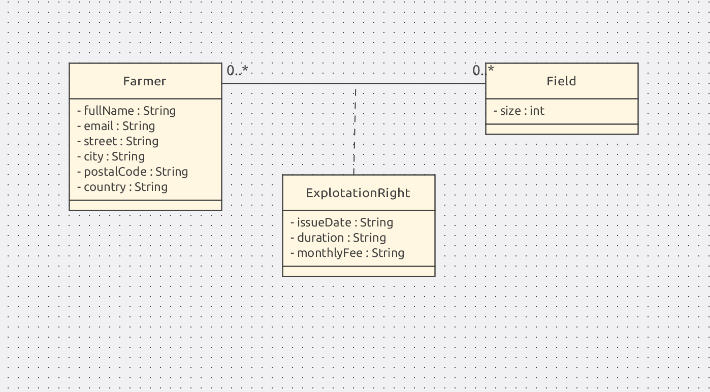
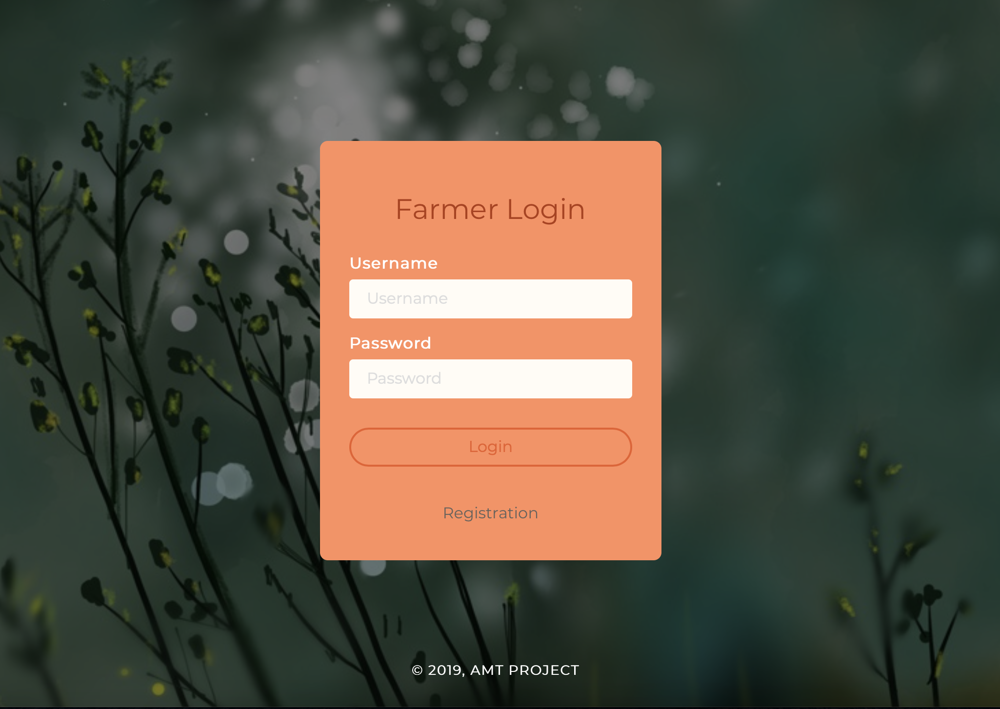
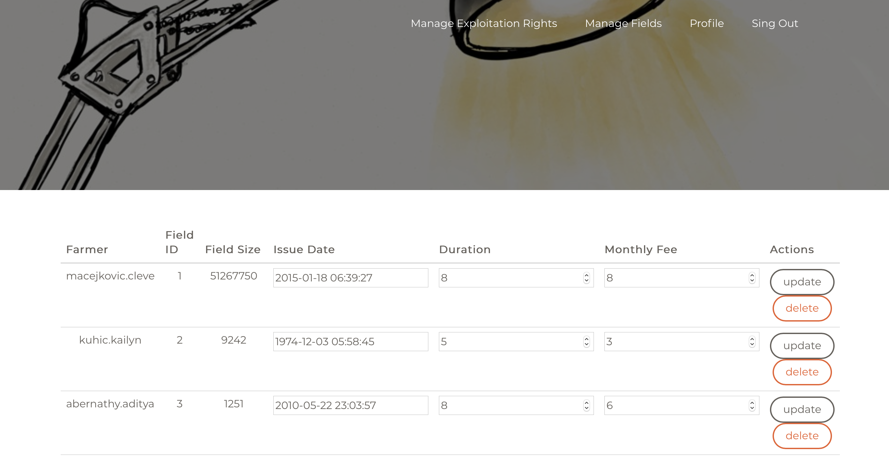
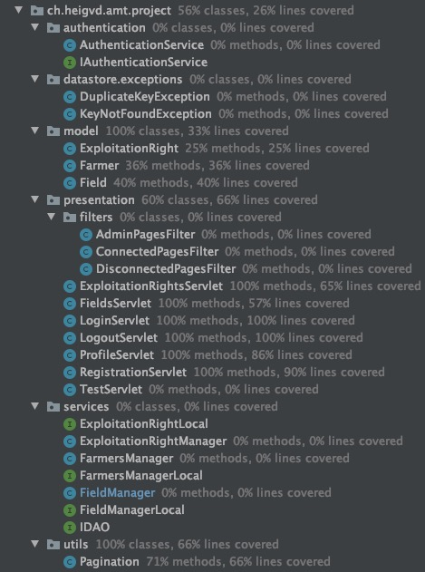

# Teaching-HEIGVD-AMT-2019-Project-One

#### Authors: Budry Nohan, Moreno Andres

## Objectives

The main objective of this project is to apply the patterns and techniques presented during the lectures, and to create a simple multi-tiered application in Java EE.

## Business domain:

For our business, we've decided to implement a *potato farm* (portal for farmers), where farmers can have a global view of their fields with their respective exploitation's rights.  

**Model**:

The application is protected, farmers must have to register and authenticate before accessing their data. We've introduced a login page.

Once a farmer has logged in, he will be redirected to his profile. Here he will find all his personal information and their explotation rights.

We've  also implemented a privilege rights. Only admin accounts are able to manage the fields, manage the explotation rights and the users. They will have the following table available.

For the implementation we've got **7 packages** authentication, exceptions, model, presentation, services, utils and webapp. 

Authentication: For hashing the password and control

Exceptions: Possible exceptions that might occur by using the database.

Model: The classes corresponding to the db table.

Presentation: Package containing the filters and the servlets

Services: Contains the DAO

Utils: Contains anything extra, in our particular case we just have the pagination.

WebAPP: Contains all the pages (bootstrap, jsp, etc.)

For the testing, we've used **Mockito** (*mocks* the different actions of our page) that allows the creation of test objects in automated unit test. We've used it in order to test the servlets. **Arquillian** (used for Java middleware testing.) was also used (not to easy to set up with Payara), in order to test the different DAOs (managers).

By using Jmetter, we've quickly realised that by having more than 32 connection the system was full and after a few moments the system crashed, giving us a % of error grater than 80%. In order to fix this, we went to the admin page of payara and change the pool settings.

We've executed all test with coverage, obtaining the following result:

Arquillian test, are executed remotely. That's the reason why we cant have a calculated coverage at inteliji.

